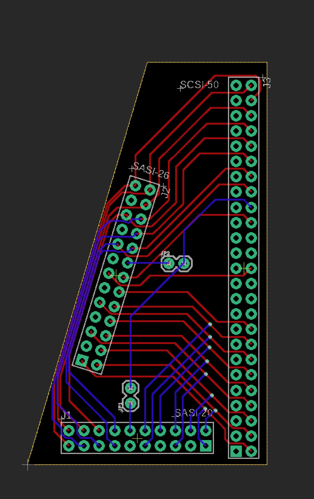

# TFSASI - SASI to SCSI Adapter

[](https://github.com/terriblefire/tfsasi/actions/workflows/gerbers.yml)
[](https://github.com/terriblefire/tfsasi/actions/workflows/schematic-pdf.yml)

A 3-way universal adapter board for connecting SASI 20-pin, SASI 26-pin, or SCSI 50-pin devices.



## Overview

This adapter allows you to connect:
- SASI 20-pin devices to SCSI 50-pin controllers
- SASI 26-pin devices to SCSI 50-pin controllers
- Mix and match between different SASI and SCSI interfaces

## Features

- **3-way adapter**: SASI 20-pin, SASI 26-pin, and SCSI 50-pin connectors
- **4-layer PCB design** for improved signal integrity
- **All signals properly mapped** between connectors
- **LED pins marked as not connected** (requires separate handling)
- **Mirrored connector footprints** for proper cable orientation
- **Full SCSI-1 compatibility** with parity and attention signals (on 26-pin)

## Connectors

### SASI 20-Pin (J1)
- 2x10 pin header (0.1" pitch)
- Basic SASI interface with data and control signals
- No parity or attention signals
- Pin 12 (LED) is not connected

### SASI 26-Pin (J2)
- 2x13 pin header (0.1" pitch)
- Full SCSI-compatible with parity and attention
- Includes TERMPWR (+5V for termination)
- Pin 16 (LED) is not connected

### SCSI 50-Pin (J3)
- 2x25 pin header (0.1" pitch)
- Standard SCSI-1 interface
- Pin 18 (DBP/parity) connects from SASI 26-pin
- Pin 32 (ATN) connects from SASI 26-pin only

## Documentation

- [PINOUTS.md](PINOUTS.md) - Complete pinout documentation for all connectors
- [LED_SPECIFICATIONS.md](LED_SPECIFICATIONS.md) - Information about LED signal characteristics

## PCB Files

The Eagle schematic and board files are in the `eagle/` directory:
- `tfsasi.sch` - Complete schematic
- `tfsasi.brd` - PCB layout (to be created)

**Note:** The board is configured as a 4-layer PCB with one layer missing. This is intentional for the design requirements.

## Building Gerbers

### Using Make (with Docker)

```bash
cd eagle
make gerbers    # Generate Gerbers and create ZIP
make pdf        # Generate PDF schematic
make clean      # Clean generated files
```

Requires Docker with the `terriblefire78/eagle:v1` image.

### Automated Builds

GitHub Actions automatically generate:
- **Gerber files** on every push to main
- **PDF schematics** on every push to main
- **Release artifacts** when you create a version tag

## Manufacturing

The board is designed for JLCPCB 4-layer manufacturing:
- Standard 1.6mm thickness
- ENIG or HASL finish recommended
- 0.1" (2.54mm) through-hole connectors

## Signal Mapping

All data lines (DB0-DB7) and control signals (BSY, ACK, RST, MSG, SEL, C/D, REQ, I/O) are connected across all three connectors.

Special signals:
- **DBP (Parity)**: Only on SASI 26-pin and SCSI 50-pin
- **ATN (Attention)**: Only on SASI 26-pin and SCSI 50-pin
- **TERMPWR**: Only on SASI 26-pin and SCSI 50-pin
- **LED**: Not connected (requires separate handling)

## License

This project is licensed under the Creative Commons Attribution-ShareAlike 4.0 International License.

See [LICENSE](LICENSE) for details.

## Author

TerribleFire

## Contributing

Contributions are welcome! Please feel free to submit pull requests or open issues for bugs and feature requests.
